# 🎬 Awesome 3D Scene Understanding Papers

### 📚 A Curated Collection of Research Papers on 3D Understanding with LLMs

**Focus Areas:** 3D understanding, 3D foundation model

---

## 🌟 3D Scene Understanding
| Method | Paper | Input | Framework | Data |
|---------------|-------|-------|-----------|------|
| MILO (2025-12) | [Seeing through Imagination: Learning Scene Geometry via Implicit Spatial World Modeling](https://arxiv.org/pdf/2512.01821) | RGB-D  Camera Para | 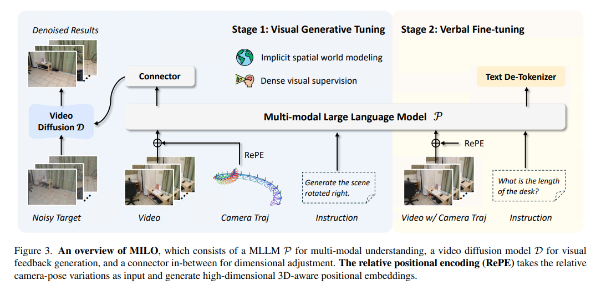 | ScanRefer / Nr3D / Sr3D / Multiscan / ArkiScenes |
| S²-MLLM (2025-12) | [S²-MLLM: Boosting Spatial Reasoning Capability of MLLMs for 3D Visual Grounding with Structural Guidance](https://arxiv.org/pdf/2512.01223) | RGB-D / Camera Para / Text / object proposals / Point Map| 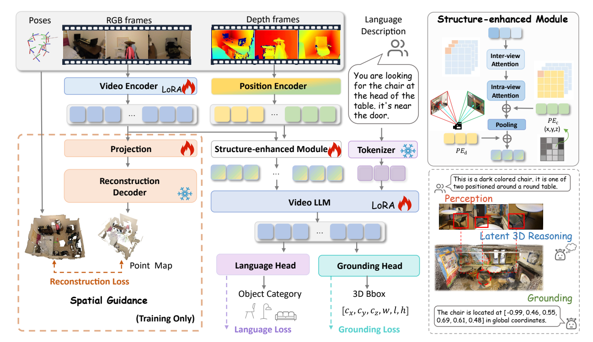 | ScanRefer / Nr3D / Sr3D / Multiscan / ArkiScenes |
| [SpaceDrive](https://zhenghao2519.github.io/SpaceDrive_Page/) (2025-12) | [SpaceDrive: Infusing Spatial Awareness into VLM-based Autonomous Driving](https://arxiv.org/abs/2512.10719v1) | RGB-D / 3D Position / Text | 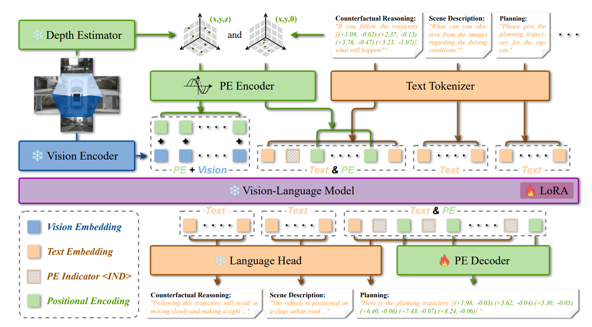 | nuScenes / Bench2Drive |
| [DSR](https://github.com/TencentARC/DSR_Suite) (2025-12) | [Learning to Reason in 4D: Dynamic Spatial Reasoning for Vision-Language Models](https://arxiv.org/abs/2512.20557) | Video / Text / Poses / Masks / Agent|  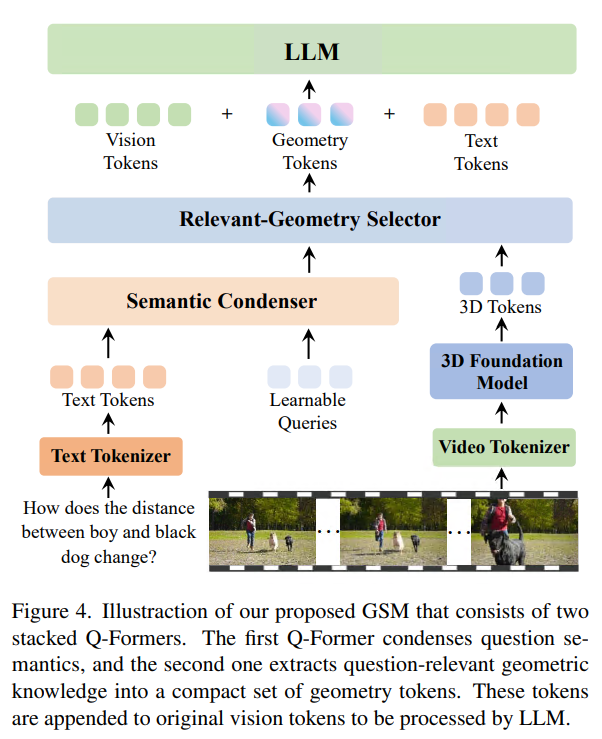| DSR-Bench|
| [VLM²](https://sairlab.org/vlm2/) (2025-11) | [Vision-Language Memory for Spatial Reasoning](https://arxiv.org/abs/2511.20644) | Video / Text / 3D Foundation Model | 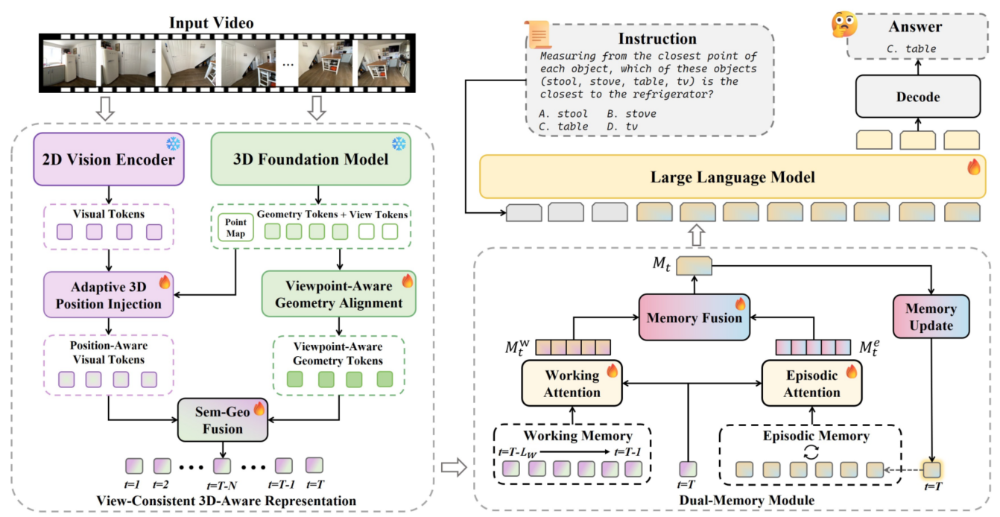  | VSI-Bench / VSTI-Bench / ScanQA / SQA3D |
| SpaceMind (2025-11) | [SpaceMind: Camera-Guided Modality Fusion for Spatial Reasoning in Vision-Language Models](https://arxiv.org/abs/2511.23075) |RGB / 3D Foundation Model / Text | 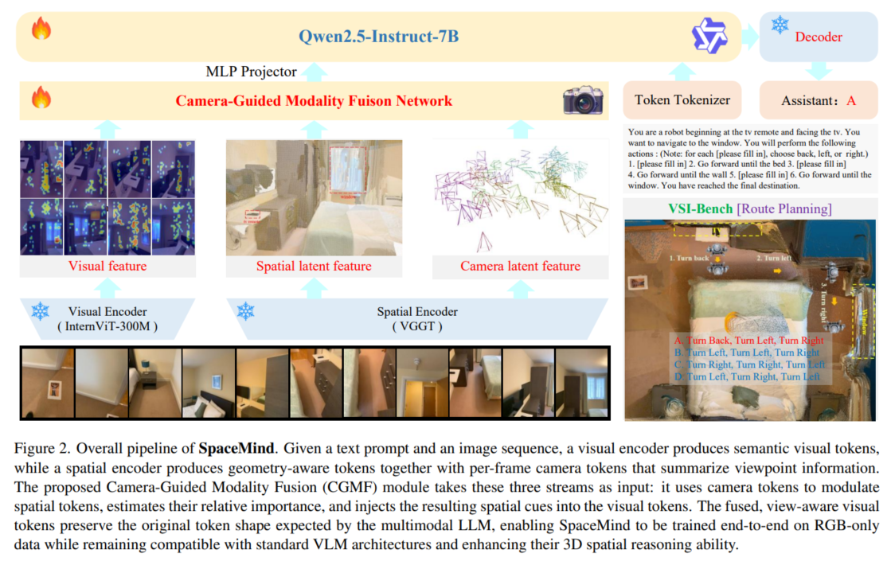 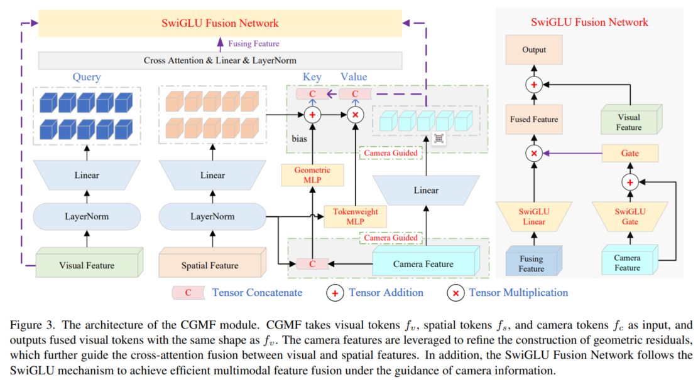 | VSI-Bench / SQA3D / SPBench |
| [3DThinker](https://github.com/zhangquanchen/3DThinker) (2025-10) | [Think with 3D: Geometric Imagination Grounded Spatial Reasoning from Limited Views](https://arxiv.org/abs/2510.18632) | RGB / Text / 3D Foundation Model| 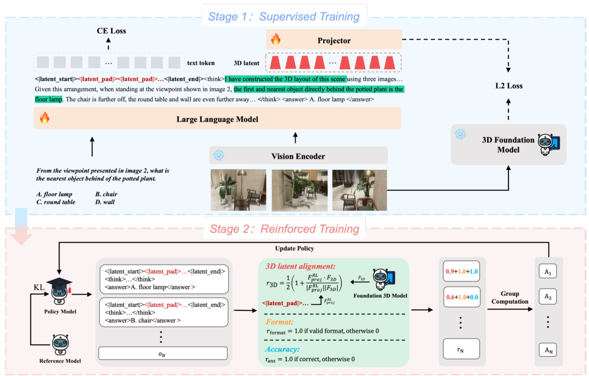 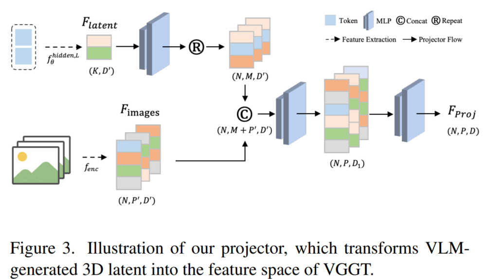 | MindCube-Tiny / Ego3D-Bench / VSI-Bench / SPBench / CV-Bench / SPAR-Bench / ViewSpatialBench / MMSI-Bench |
| [SpaceVista](https://github.com/PeiwenSun2000/SpaceVista) (2025-10) | [SPACEVISTA: CALL-SCALE VISUAL SPATIAL REASONING FROM mm TO km](https://arxiv.org/abs/2510.09606) | RGB video / Text | 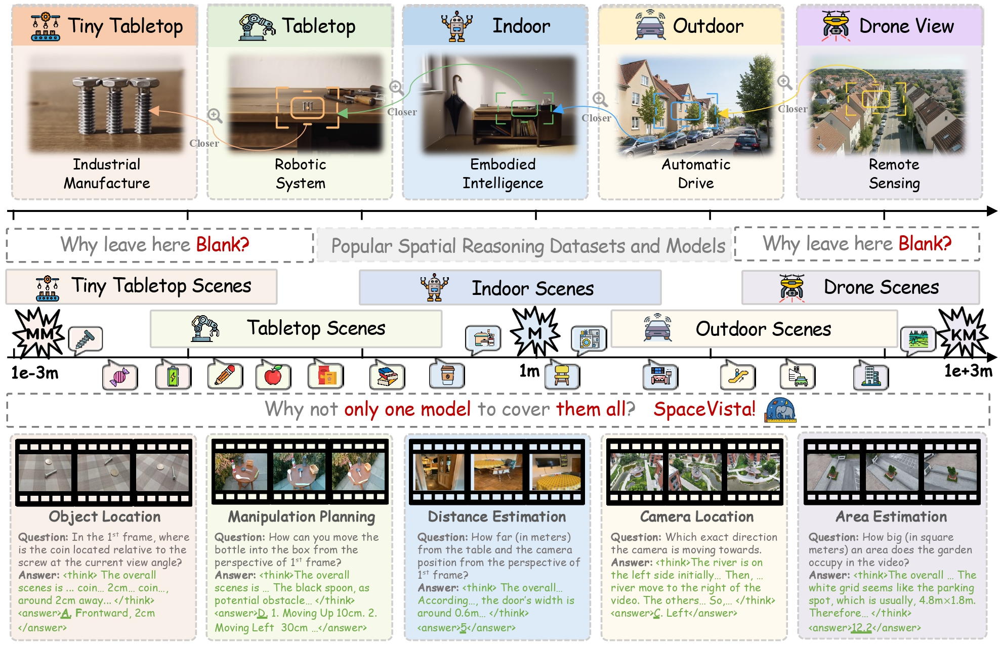 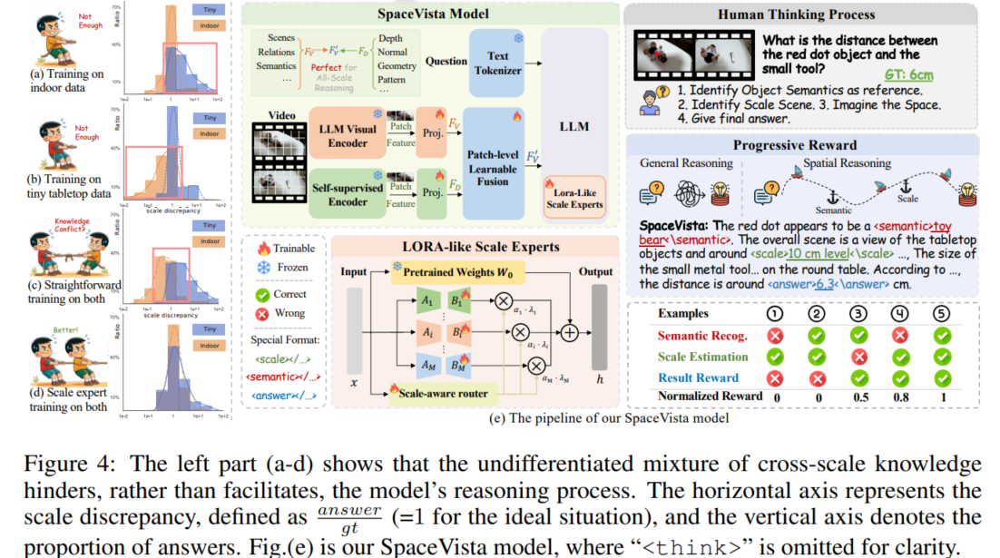 | SpaceVista |
| [SR-3D](https://www.anjiecheng.me/sr3d) (2025-09) | [SR-3D: Spatial Region 3D Aware Vision-Language Model](https://arxiv.org/abs/2509.13317) |  |  | Scan2Cap / ScanQA / SQA3D / BLINK / COCO2017 / SR-3D-Bench / VSI-Bench |
| [SD-VLM](https://github.com/cpystan/SD-VLM) (2025-09) | [SD-VLM: Spatial Measuring and Understanding with Depth-Encoded Vision-Language Models](https://arxiv.org/abs/2509.17664) | RGB-Depth / Text | 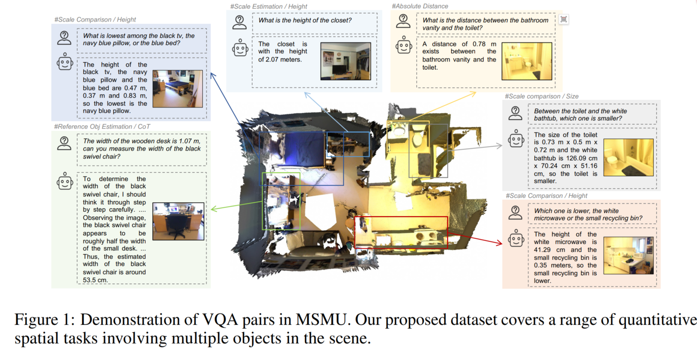 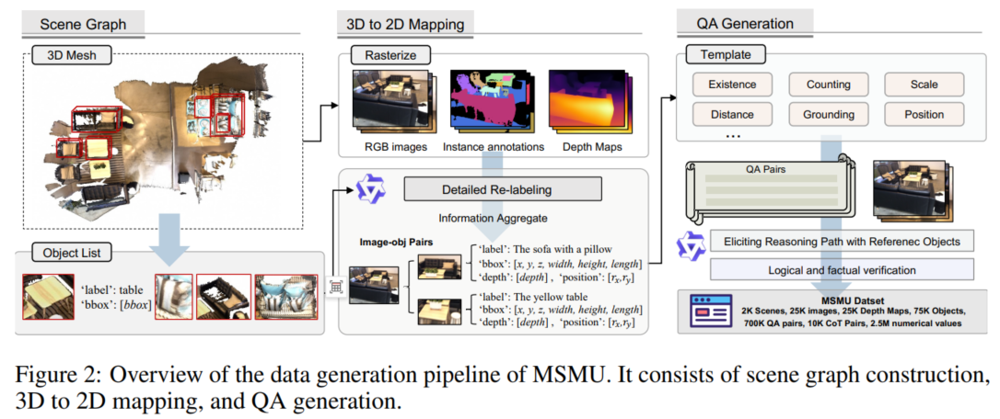 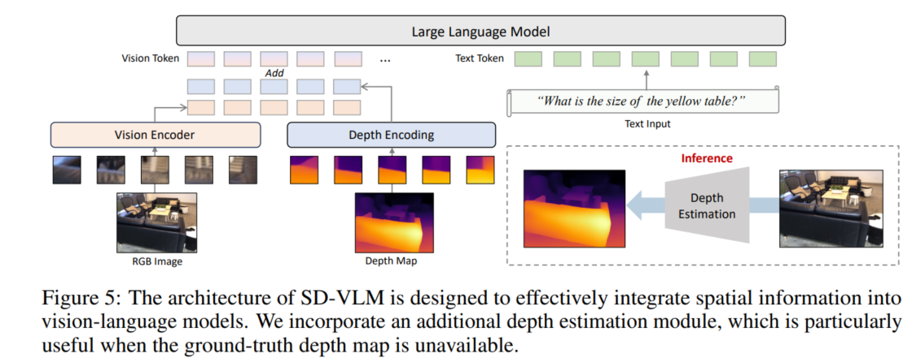| MSMU-Bench / Q-Spatial++ / SpatialRGPT-Bench / Whatsup / GQA / TextVQA / VQA-v2 / Vizwiz |
| [RynnEC](https://github.com/alibaba-damo-academy/RynnEC) (2025-08) | [RynnEC: Bringing MLLMs into Embodied World](https://arxiv.org/abs/2508.14160) | Video / Text / Mask| 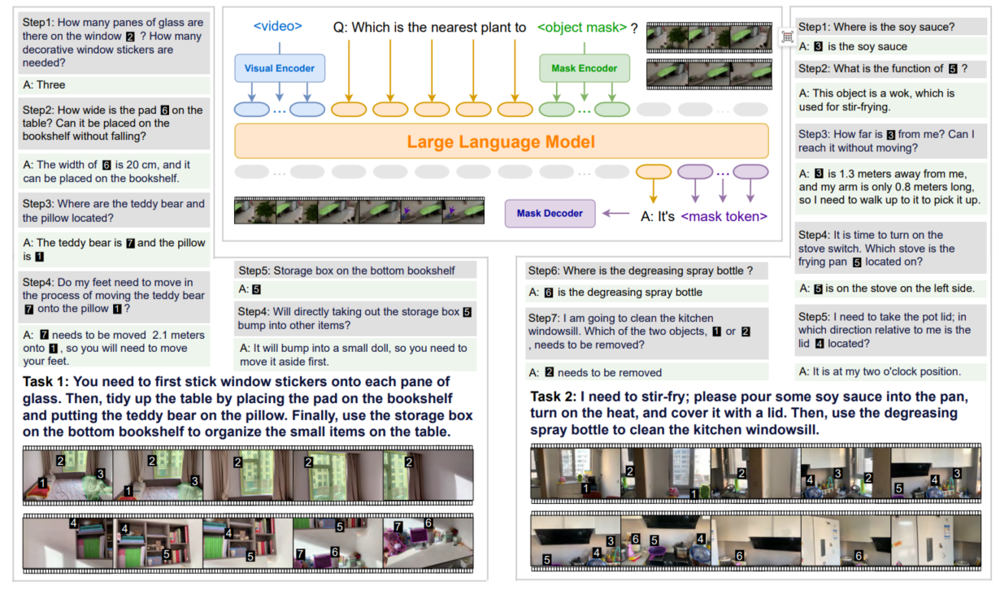 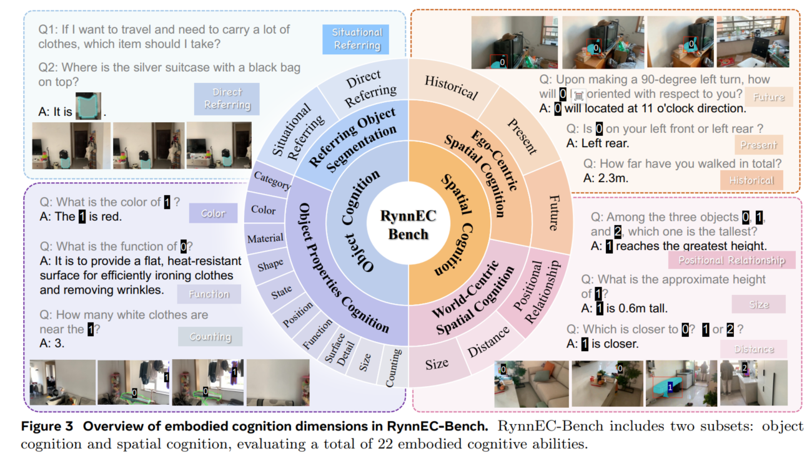| RynnEC-Bench |
| [3D-R1](https://aigeeksgroup.github.io/3D-R1/) (2025-07) | [3D-R1: Enhancing Reasoning in 3D VLMs for Unified Scene Understanding](https://arxiv.org/abs/2507.23478) | RGB-D / Text / Point map |  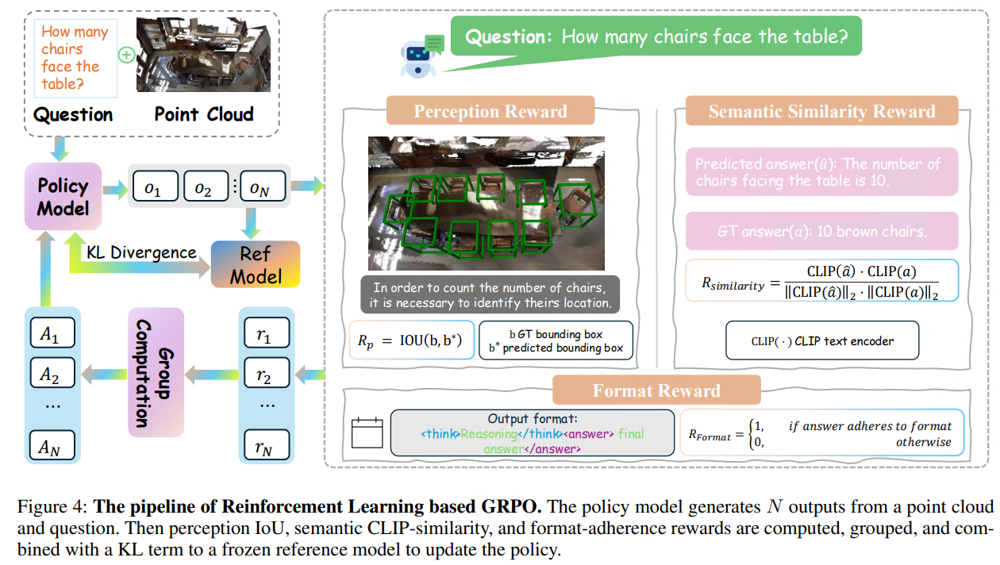 | ScanRefer / Nr3D / ScanQA / Cap3D / 3D-LLM / SQA3D |
| [RoboRefer](https://zhoues.github.io/RoboRefer/) (2025-06) | [RoboRefer: Towards Spatial Referring with Reasoning in Vision-Language Models for Robotics](https://arxiv.org/pdf/2506.04308) | RGB-D / Text | 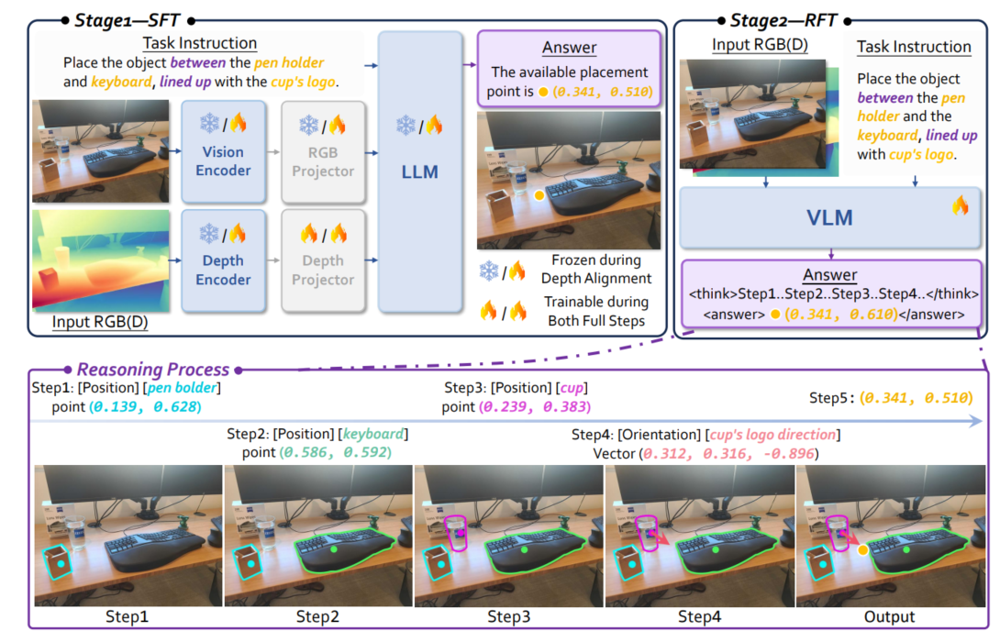 | CV-Bench / BLINK / RoboSpatial / SAT / EmbSpatial / RoboRefIt / Where2Place  / RoboSpatial / RefCOCO  / RefCOCO+  / RefCOCOg / NVILA-2B  / RoboRefer |
| [3DRS](https://visual-ai.github.io/3drs) (2025-06) | [MLLMs Need 3D-Aware Representation Supervision for Scene Understanding](https://arxiv.org/abs/2506.01946) | RGB / Text / 3D Features | 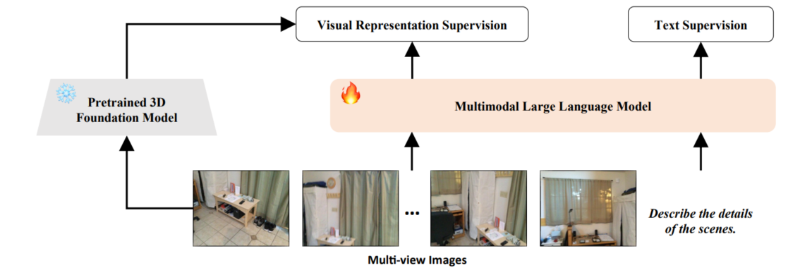 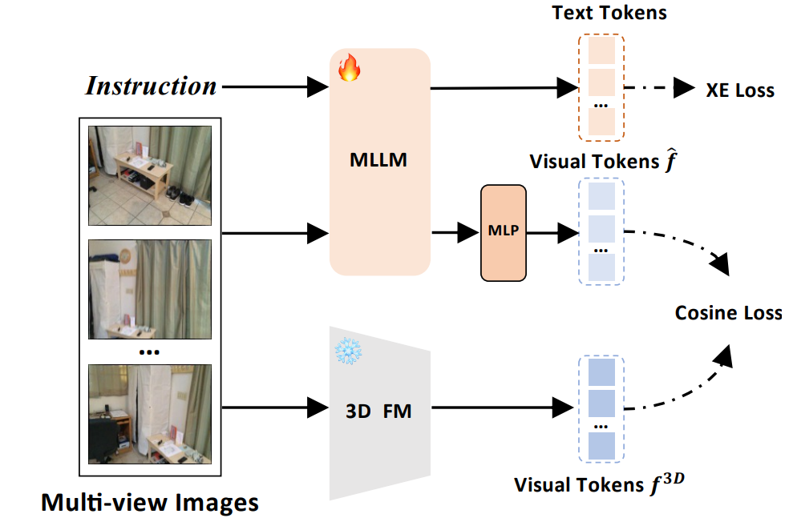| Multi3DRef / ScanRefer3D / Scan2Cap / ScanQA / SQA3D |
| Scene-R1 (2025-06) | [Scene-R1: VIDEO-GROUNDED LARGE LANGUAGE MODELS FOR 3D SCENE REASONING WITHOUT 3D ANNOTATIONS](https://arxiv.org/abs/2506.17545) |  | 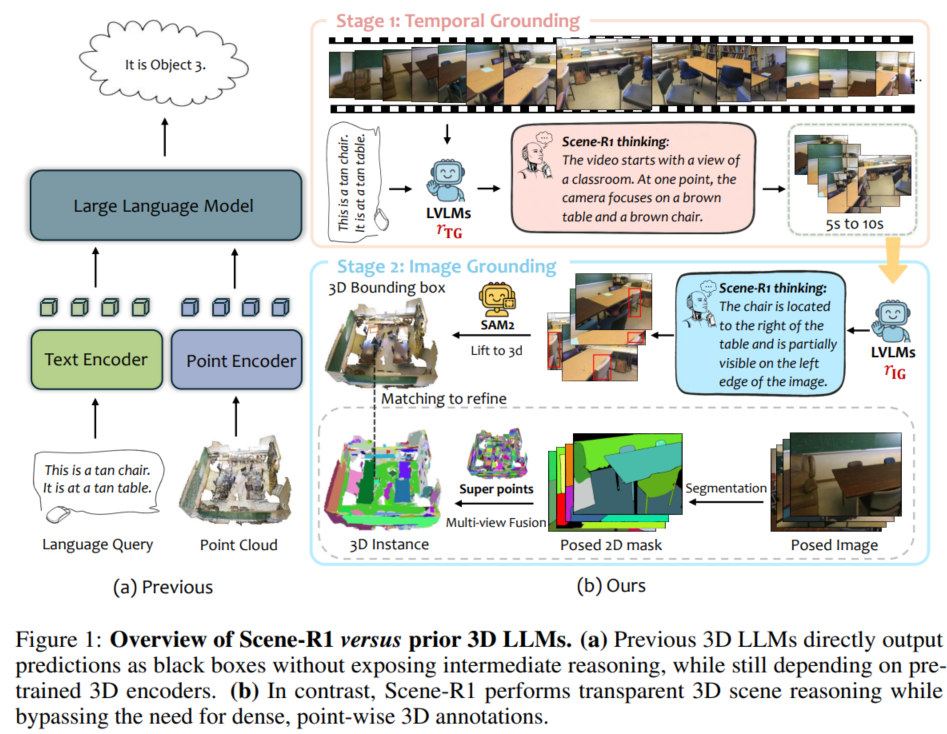 | ScanRefer / VSI-Bench |
| [SpatialLM](https://manycore-research.github.io/SpatialLM/) (2025-06) | [SpatialLM: Training Large Language Models for Structured Indoor Modeling](https://arxiv.org/abs/2506.07491) |  |  | ScanNet \ Layout Estimation \ 3D Object Detection |
| [SSR](https://yliu-cs.github.io/SSR) (2025-05) | [SSR: Enhancing Depth Perception in Vision-Language Models via Rational-e-Guided Spatial Reasoning](https://arxiv.org/abs/2505.12448) | RGB-D /Text | 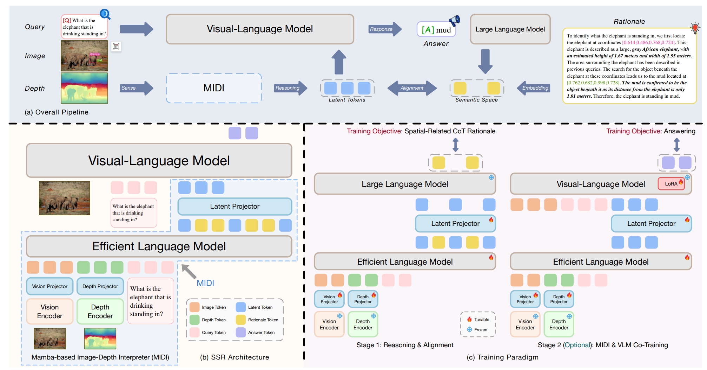 | SpatialBench / SSRBENCH / CV-Bench / VQA |
| [Spatial-MLLM](https://diankun-wu.github.io/Spatial-MLLM/) (2025-05) | [Spatial-MLLM: Boosting MLLM Capabilities in Visual-based Spatial Intelligence from Pure 2D Observations](https://arxiv.org/abs/2505.23747) | RGB / Text /3D Foundation Model|  | Spatial-MLLM-120k / VSI-Bench / SQA3D / SPBench / Q-Spatial |
| [SAMA](https://github.com/sunye23/SAMA) (2025-05) | [SAMA: Towards Multi-Turn Referential Grounded Video Chat with Large Language Models](https://arxiv.org/abs/2505.18812) | video / Text / Masks | 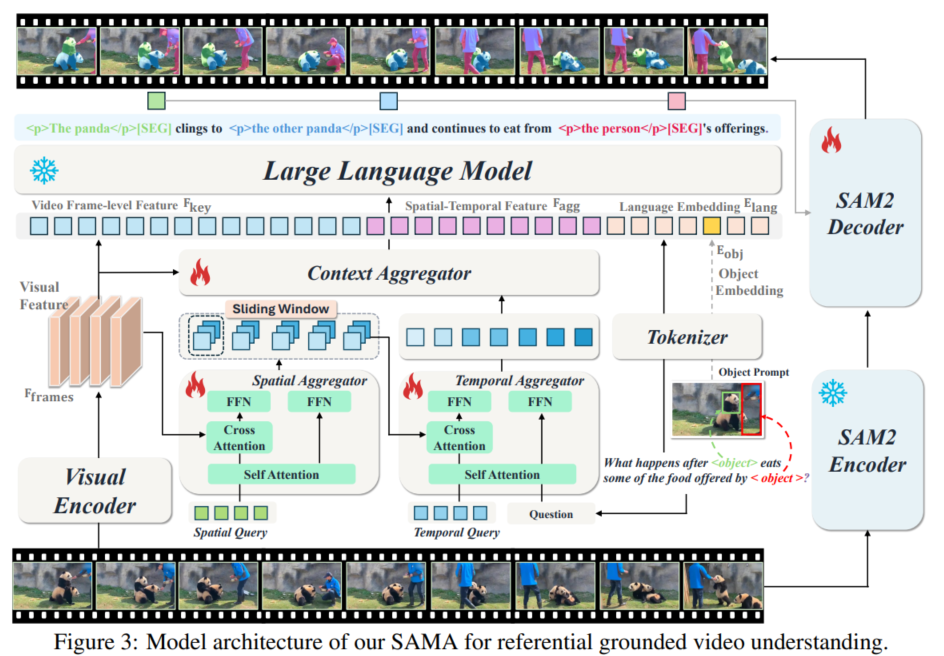 | SAMA-Bench / RefCOCO / RefCOCO+ / RefCOCOg / GCG  / MeViS / Ref-DAVIS17 / Ref-YTVOS / ReVOS / MME / MMBench  / SEED-Benc / AI2D  / MMStar / SQA / Video-MME |
| [ViewSpatial](https://github.com/ZJU-REAL/ViewSpatial-Bench) (2025-05) | [ViewSpatial-Bench: Evaluating Multi-perspective Spatial Localization in Vision-Language Models](https://arxiv.org/abs/2505.21500) |  | 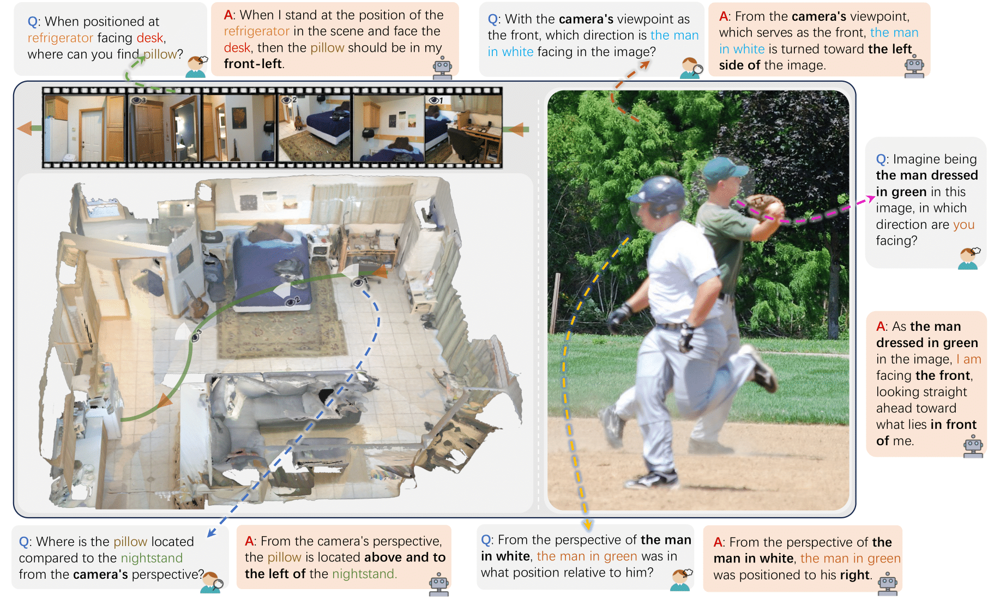 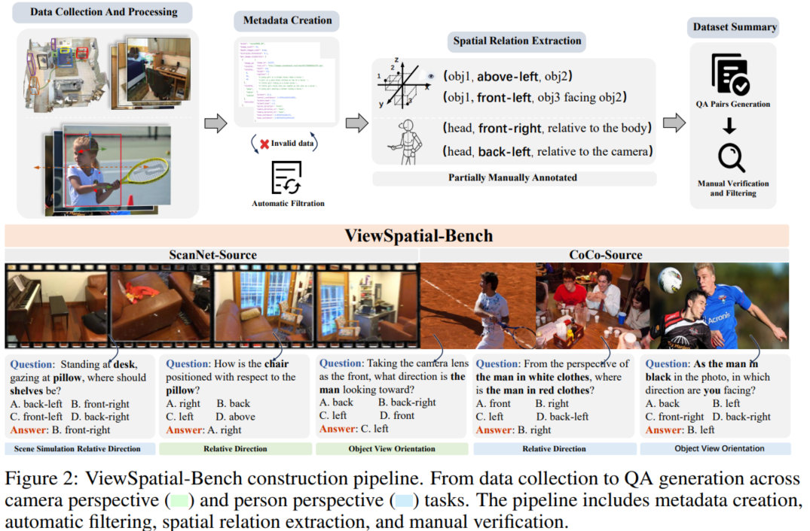  | ViewSpatial-Bench / VSI-Bench / VSI-App |
| [Ross3D](https://haochen-wang409.github.io/ross3d) (2025-04) | [ROSS3D: Reconstructive Visual Instruction Tuning with 3D-Awareness](https://arxiv.org/abs/2504.01901) |  | 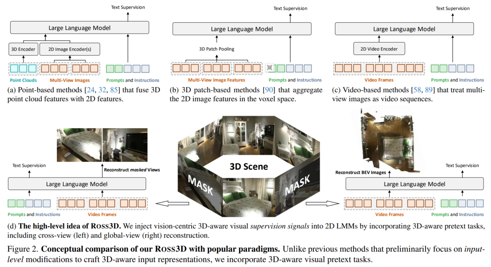 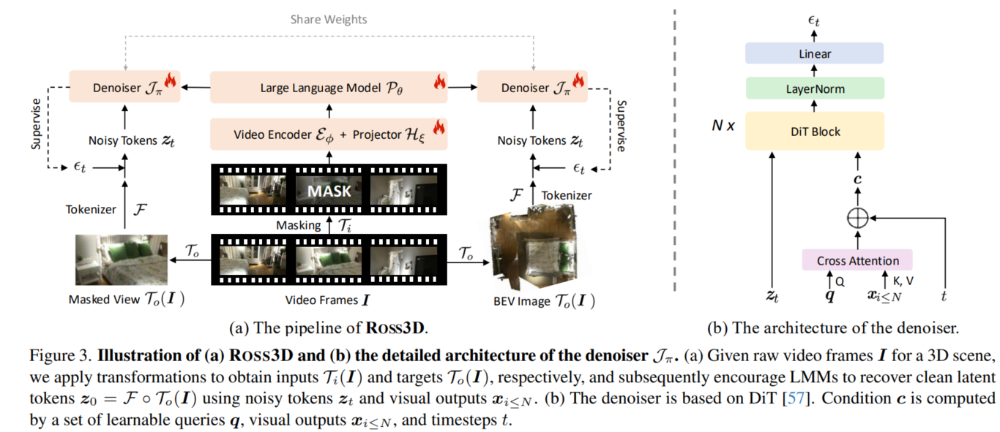  | Multi3DRef / ScanRefer3D / Scan2Cap / ScanQA / SQA3D |
| SITE | [SITE: BRIDGING TEXT AND IMAGE MODALITIES WITH LLMS FOR 3D SCENE UNDERSTANDING](https://openreview.net/pdf/fa6e3cb48582a19b228a5cbc3373874931a9e970.pdf)|  | 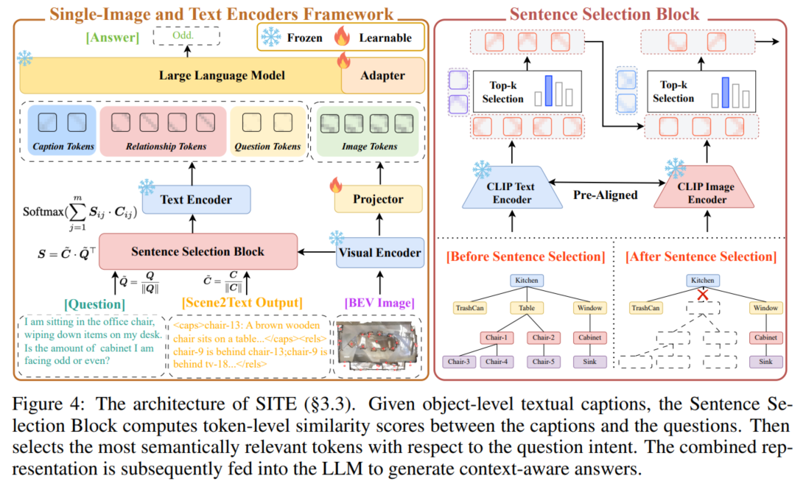  | Multi3DRef / ScanRefer3D / Scan2Cap / ScanQA / SQA3D / METEOR / ROUGE / BLEU-4  / CIDEr

## 🌙 3D Foundation Model
| Method | Paper | Framework | Data |
|---------------|-------|-----------|------|
| [Depth Anything 3](https://depth-anything-3.github.io) (2025-11) | [Depth Anything 3: Recovering the Visual Space from Any Views](https://arxiv.org/abs/2511.10647) | 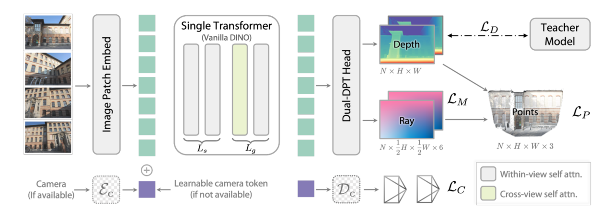 | HiRoom / ETH3D / DTU / 7Scenes / ScanNet++ |
| [STream3R](https://nirvanalan.github.io/projects/stream3r/) (2025-08) | [STream3R: Scalable Sequential 3D Reconstruction with Causal Transformer](https://arxiv.org/abs/2508.10893) | 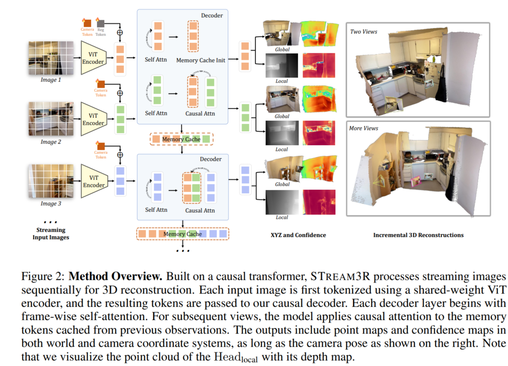 | Sintel  / Bonn / KITTI / NYU-v2 / TUM-dynamics  / ScanNet |
| [Uni3R](https://github.com/dptech-corp/Uni-3DAR) (2025-08) | [Uni3R: Unposed 3D Reconstruction and Semantic Understanding via Gaussian Splatting](https://arxiv.org/abs/2508.03643) | 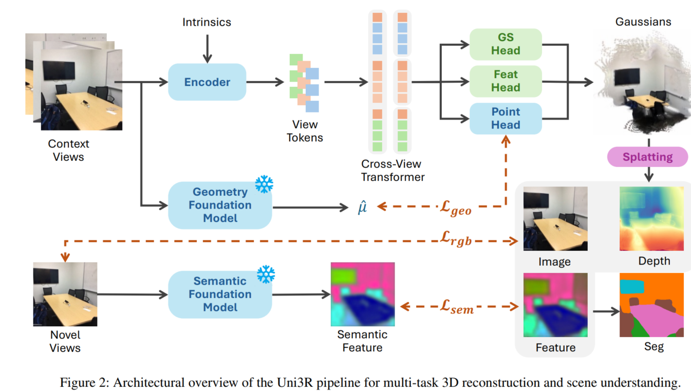 | ScanNet |
| [VGGT-Long](https://github.com/DengKaiCQ/VGGT-Long) (2025-07) | [VGGT-Long: Pushing VGGT’s Limits on Kilometer-scale RGB Sequences](https://arxiv.org/abs/2507.16443) | 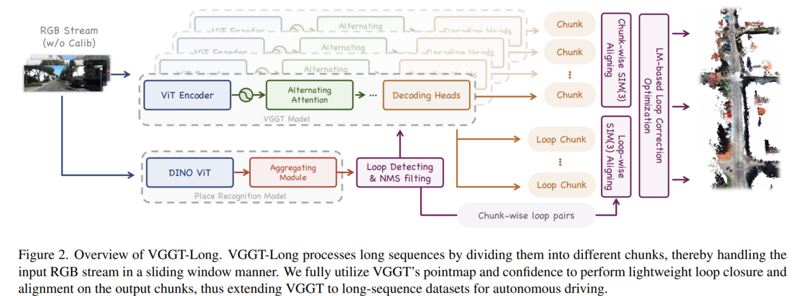 | KITTI / Waymo / Virtual KITTI |
| [StreamVGGT](https://wzzheng.net/StreamVGGT/) (2025-07) | [Streaming 4D Visual Geometry Transformer](https://arxiv.org/abs/2507.11539) | 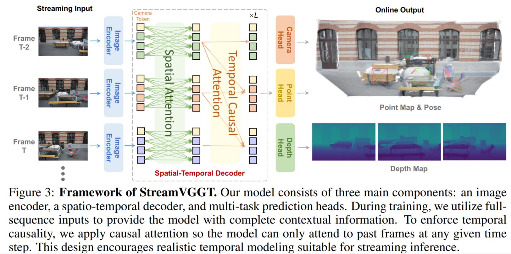 | 7-Scenes / NRGBD / KITTI / Sintel / Bonn / NYU-v2 / Sintel|
| [Dens3R](https://github.com/G-1nOnly/Dens3R) (2025-07) | [Dens3R: A Foundation Model for 3D Geometry Prediction](https://arxiv.org/abs/2507.16290) | 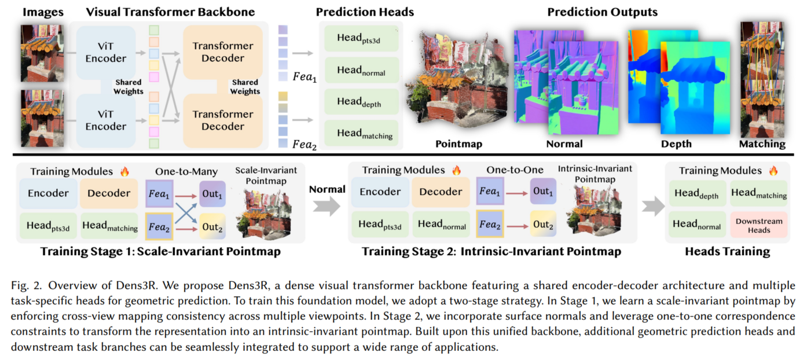 | NYUv2  / ScanNet / IBims-1  / Sintel / DIODE-outdoor / ZEB |
| [VGGT](https://github.com/facebookresearch/vggt) (2025-03) | [VGGT: Visual Geometry Grounded Transformer](https://arxiv.org/abs/2503.11651) | 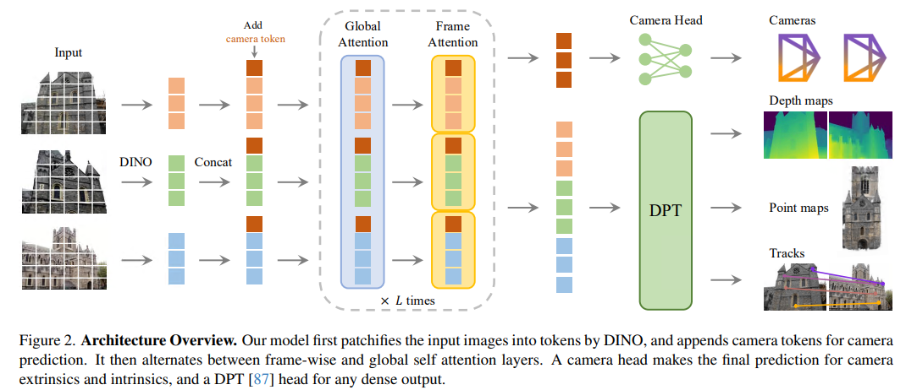 | Re10K / CO3Dv2 / RealEstate10K / DTU / ETH3D / ScanNet-1500  / GSO / TAP-Vid |
| [Fast3R](https://github.com/facebookresearch/fast3r) (2025-01) | [Fast3R: Towards 3D Reconstruction of 1000+ Images in One Forward Pass](https://arxiv.org/abs/2501.13928) | 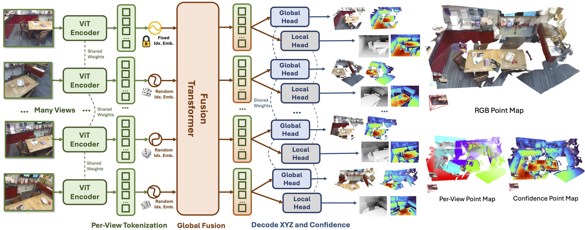 | CO3D-v2 / RealEstate10K / 7 Scenes / Mip-NeRF 360 |
| [CUT3R](https://cut3r.github.io/) (2025-01) | [CUT3R: Continuous Updating Transformer for 3D Reconstruction](https://arxiv.org/abs/2501.12387) | 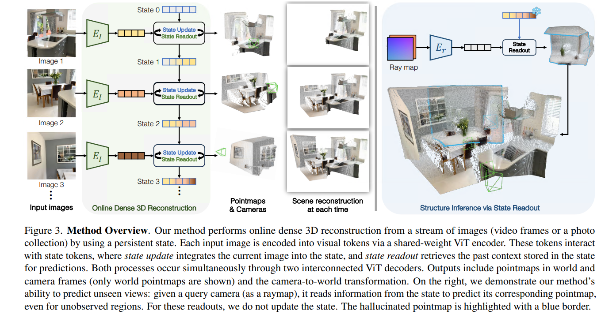 | Sintel  / Bonn / KITTI / NYU-v2 / TUM-dynamics  / ScanNet / 7 scenes / NRGBD |
| [DUSt3R](https://github.com/naver/dust3r) (2023-12) | [DUSt3R: Geometric 3D Vision Made Easy](https://arxiv.org/abs/2312.14132) | 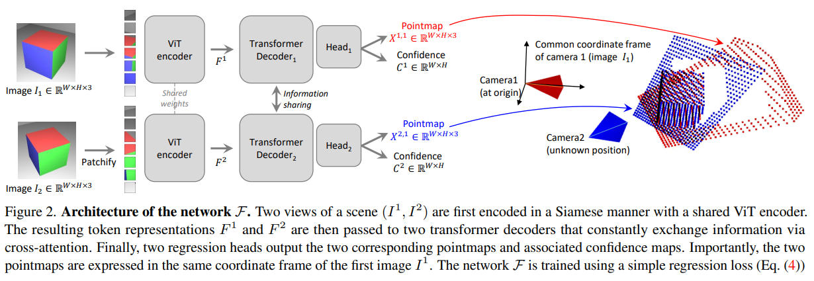 | 7Scenes / Cambridge  / KITTI / ScanNet / ETH3D / DTU / T&T |

## Experimental results on 3D scene understanding benchmarks

“Expert Models” train a separate model for each task, whereas “Generalist MLLMs” train a single model for all tasks.

| Method                  | Point Encoder | ScanRefer                  |             | Multi3DRefer               |             | Scan2Cap                   |             | ScanQA             |         | SQA3D   |
|-------------------------|---------------|----------------------------|-------------|----------------------------|-------------|----------------------------|-------------|--------------------|---------|---------|
|                         |               | Acc@0.25                   | Acc@0.5     | F1@0.25                    | F1@0.5      | C@0.5                      | B-4@0.5     | C                  | EM      | EM      |
| **Expert Models**       |               |                            |             |                            |             |                            |             |                    |         |         |
| 3D-VLP                  | ✓             | 51.4                       | 39.5        | —                          | —           | 54.9                       | 32.3        | 67.0               | 21.7    | —       |
| 3D-VisTA                | ✓             | 50.6                       | 45.8        | —                          | —           | 61.6                       | 34.0        | 69.6               | 22.4    | 48.5    |
| 3DJCG                   | ✓             | 49.6                       | 37.3        | —                          | 26.6        | 49.5                       | 31.0        | —                  | —       | —       |
| **Generalist MLLMs**    |               |                            |             |                            |             |                            |             |                    |         |         |
| 3D-LLM                  | ✓             | 30.3                       | –           | –                          | –           | –                          | –           | 69.4               | 20.5    | 49.4    |
| Chat-3D v2              | ✓             | 42.5                       | 38.4        | 45.1                       | 41.6        | 63.9                       | 31.8        | 87.6               | –       | 54.7    |
| LL3DA                   | ✓             | –                          | –           | –                          | –           | 62.9                       | 36.0        | 76.8               | –       | –       |
| SceneLLM                | ✓             | –                          | –           | –                          | –           | –                          | –           | 80.0               | 27.2    | 53.6    |
| LEO                     | ✓             | –                          | –           | –                          | –           | 72.4                       | 38.2        | **101.4**          | 21.5    | 50.0    |
| Grounded 3D-LLM         | ✓             | 47.9                       | 44.1        | 45.2                       | 40.6        | 70.6                       | 35.5        | 72.7               | –       | –       |
| PQ3D                    | ✓             | **57.0**                   | **51.2**    | –                          | **50.1**    | **80.3**                   | 36.0        | –                  | –       | 47.1    |
| ChatScene               | ✓             | 55.5                       | 50.2        | **57.1**                   | **52.4**    | 77.1                       | 36.3        | 87.7               | 21.6    | 54.6    |
| Ross3D†                 | —             | **60.6**                   | **54.1**    | **58.8**                   | **53.8**    | **82.2**                   | **46.4**    | **105.1**          | **30.6**| **60.6**|
| LLaVA-3D                | —             | 54.1                       | 42.4        | –                          | –           | 79.2                       | 41.1        | 91.7               | 27.0    | 55.6    |
| Inst3D-LLM              | ✓             | 57.8                       | 51.6        | 58.3                       | 53.5        | 79.7                       | 38.3        | 88.6               | 24.6    | –       |
| 3D-LLaVA                | ✓             | 51.2                       | 40.6        | –                          | –           | 78.8                       | 36.9        | 92.6               | –       | 54.5    |
| Video-3D LLM            | —             | 58.1                       | 51.7        | 58.0                       | 52.7        | 83.8                       | 41.3        | 102.1              | 30.1    | 58.6    |
| MILO                    | —             | **61.3**                   | **54.7**    | **59.4**                   | **54.2**    | **85.6**                   | **47.5**    | **107.3**          | **31.0**| **60.9**|
